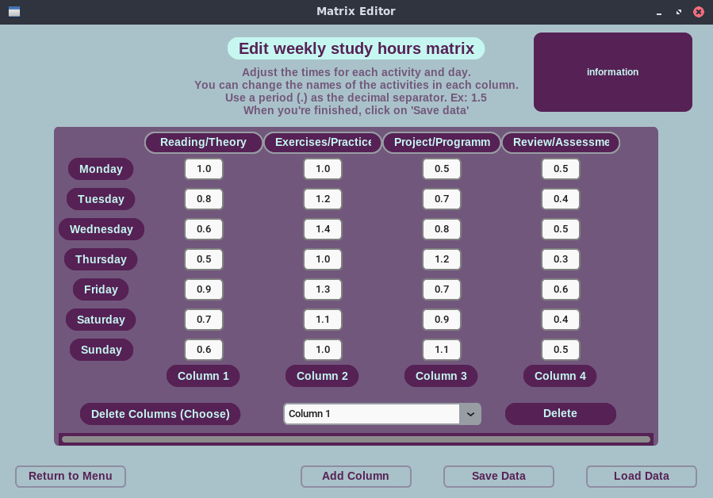
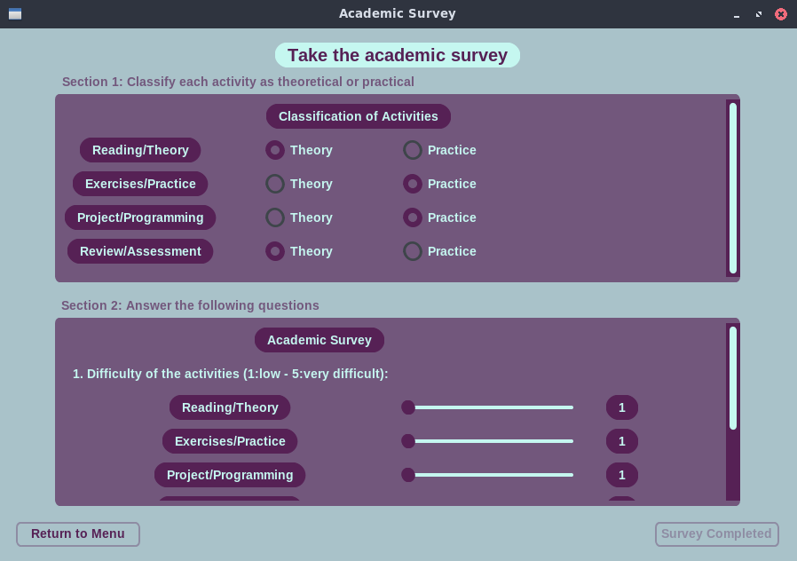
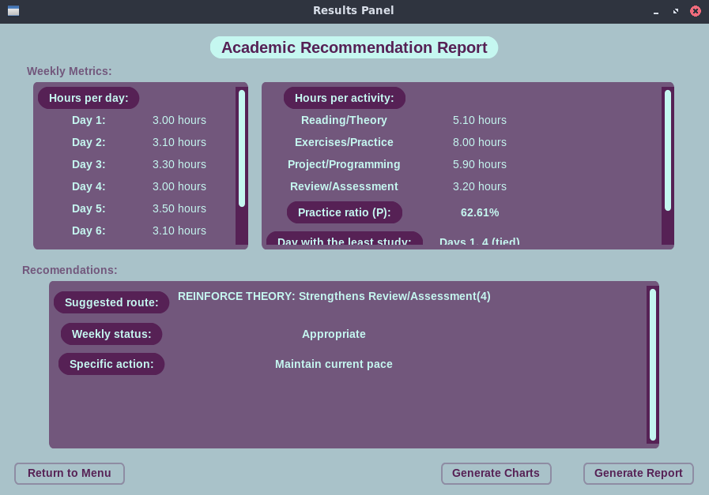
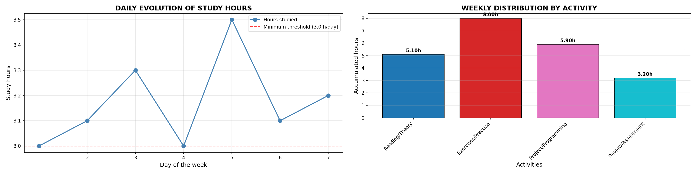
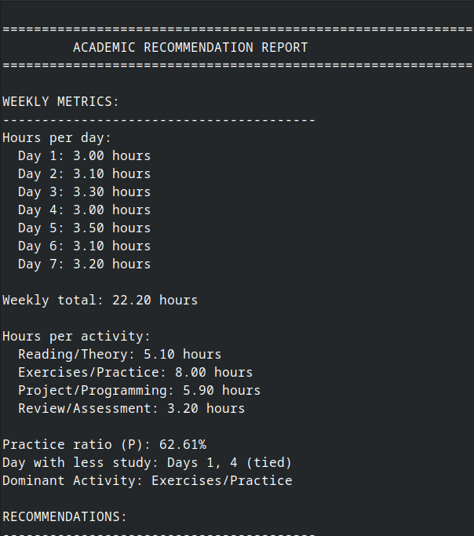

# Academic Path Recommender

[](https://www.python.org/)
[](LICENSE)
[](https://github.com/SrSherman333/academic_path_recommender/commits/main)
[](https://github.com/SrSherman333/academic_path_recommender)

**Project on an academic recommendation system developed in Python for Programming Fundamentals - UTMACH CDIA**

<div align="center">
  
</div>

## Key Features
- **Matrix editor** whose function is to store the hours used for each activity daily
- **Capacity to include** a maximum of 10 activities (In the matrix editor)
- **Survey to analyze** the difficulty level of each activity, including other parameters necessary for the recommendation
- **Labels with informative** messages about errors or incorrect values ​​entered (Matrix and Survey)
- **Generation of 2 graphs** (line and bar) about the results obtained
- **Generating a report** with the data obtained (currently .txt, soon .pdf)
- **Saving a .json file** where both the matrix and survey data will be stored, so they can be loaded if desired.

## Description of each window
| # | Window | Description |
|---|-------------|-------------|
| 1 | Matrix editor | A predefined 7x4 matrix is ​​presented, with rows representing days (Monday to Friday) and columns representing activities (also predefined). This window allows you to enter the corresponding number of hours spent on each activity for each day in each cell. You can add up to 10 columns, as well as delete them, and save or load the information. By default, a .json file will always be created containing all the information entered into the matrix. It is important to press the "Save" button; otherwise, the matrix data will not be reflected in the survey
| 2 | Survey | A survey is presented where you must first classify the activities previously entered in the Matrix Editor. This classification helps determine which activities are practical or theoretical, information that will be used later. Next, you must specify the difficulty level (1-5) of each activity. Then, you will answer three required questions: Daily available time, minimum number of hours, and minimum percentage of practice. All of this information is required to display the results; if you do not answer all the questions, the save button will not activate |
| 3 | Results | This window displays various data points, classified into three sections: 1. Data related to the days, 2. Data related to the activities, and 3. The necessary academic recommendation based on all this data. There are also two buttons. The first generates two graphs: a line graph detailing the daily evolution of study hours and a bar graph detailing the weekly distribution of hours by activity. The second button generates a text file to save all the presented data |
| 4 | Home | This is the main window, and it's where you'll access each of the others, following the logic that you need to finish the matrix and the survey to unlock the "view results" button, as well as unlock a reset button to delete all the data and start over (although the .json file will still exist so you can load its information whenever you want) |

## Galery
<div align="center">
  <p>Main Interface</p>
  <p>Matrix editor interface</p>
  <p>Survey interface</p>
  <p>Results interface</p>
  <p>Example of graphs</p>
  <p>Report text file</p>
  <br>
</div>

## Installation and use
### Prerequisites
- Python 3.11.2 or higher
- pip (python package manager)

### Installation
Clone the repository
```bash
git clone https://github.com/SrSherman333/academic_path_recommender
cd academic_path_recommender
```
Install dependencies
```bash
pip install -r requirements.txt
```

### Execution
Version with graphical interface (recommended)
```bash
python -m src.gui.app
```
Console version
```bash
python -m src.cli
```

## Project Structure
```text
academic_path_recommender/
├── src/
│   ├── core/     # Files for program logic
│   ├── gui/            # Graphic interface with CustomTkinter
│   └── cli.py         # Console Version
├── docs/               # Icons and screenshots
├── .gitignore          # Files ignored by Git
├── LICENSE             # MIT license
├── requirements.txt    # Dependencies
└── README.md           # This file
```

## Development
### Run in development mode
Install in development mode

```text
pip install -e .
```
### Main dependencies
<ul>
  <li><b>Customtkinter:</b> For the modern graphical interface</li>
  <li><b>Pillow:</b>For images</li>
  <li><b>Numpy:</b>For calculations</li>
</ul>

## Upcoming Improvements
<ul>
  <li>Add report in PDF format</li>
  <li>Possible design change</li>
  <li>Implement dark mode</li>
  <li>Implement a dialog box to save files where the user chooses</li>
  <li>Internationalization (Spanish/English)</li>
  <li>More advanced recommendations in the results interface</li>
</ul>

## Autor
<b>Dereck Misael Tandazo Brito</b> - Student of Data Science and AI - UTMACH
<ul>
  <li><b>GitHub:</b> @SrSherman333</li>
  <li><b>Portafolio:</b> Academic Portfolio</li>
</ul>

## Subject
<b>Programming Fundamentals</b> - First Semester
Career in Data Science and Artificial Intelligence
Technical University of Machala (UTMACH) - 2025 - 2026

## License
This project is licensed under the MIT License - see the LICENSE file for details

<div align="center">😄</div>